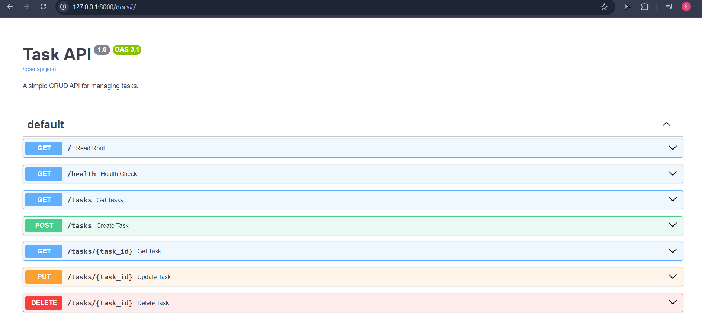

# Task API

A simple CRUD API for managing tasks, built with FastAPI as part of the FlyRank AI Internship.

## What this is

A REST API with an in-memory task list supporting full CRUD operations (Create, Read, Update, Delete), input validation, and interactive documentation via Swagger UI.

## How to run it

```bash
git clone https://github.com/Swathy-S-08/CRUD_API-.git
cd CRUD_API-/hello-server
python -m venv venv
venv\Scripts\activate        # Windows
pip install fastapi uvicorn
uvicorn main:app --reload --port 8000
```

Then visit `http://localhost:8000`.

## Endpoints

| Method | Endpoint         | Description                          | Success | Error                     |
|--------|------------------|---------------------------------------|---------|----------------------------|
| GET    | `/`              | API info                              | 200     | —                          |
| GET    | `/health`        | Health check                          | 200     | —                          |
| GET    | `/tasks`         | List all tasks                        | 200     | —                          |
| GET    | `/tasks/{id}`    | Get a single task                     | 200     | 404 if not found           |
| POST   | `/tasks`         | Create a task (`{"title": "..."}`)    | 201     | 400 if title missing/empty |
| PUT    | `/tasks/{id}`    | Update a task's title and/or done     | 200     | 404 if not found, 400 if title invalid |
| DELETE | `/tasks/{id}`    | Delete a task                         | 204     | 404 if not found           |

## Example request

```
curl -i http://localhost:8000/tasks/1
```

```
HTTP/1.1 200 OK
date: Sun, 19 Jul 2026 15:27:04 GMT
server: uvicorn
content-length: 44
content-type: application/json

{"id":1,"title":"Learn FastAPI","done":true}
```

## Interactive docs

FastAPI auto-generates Swagger UI at `/docs`:

