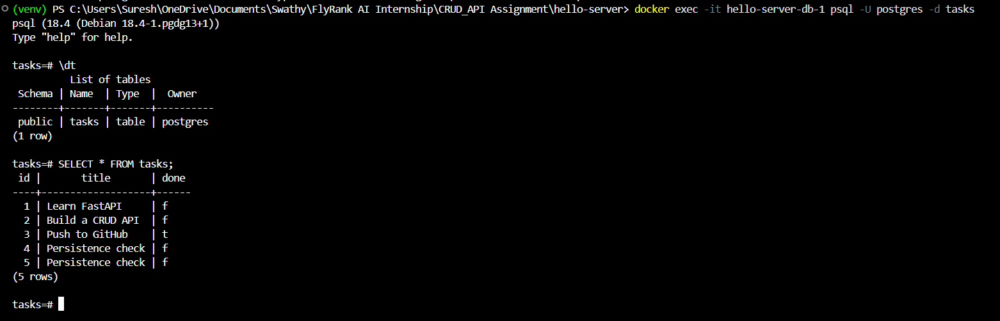
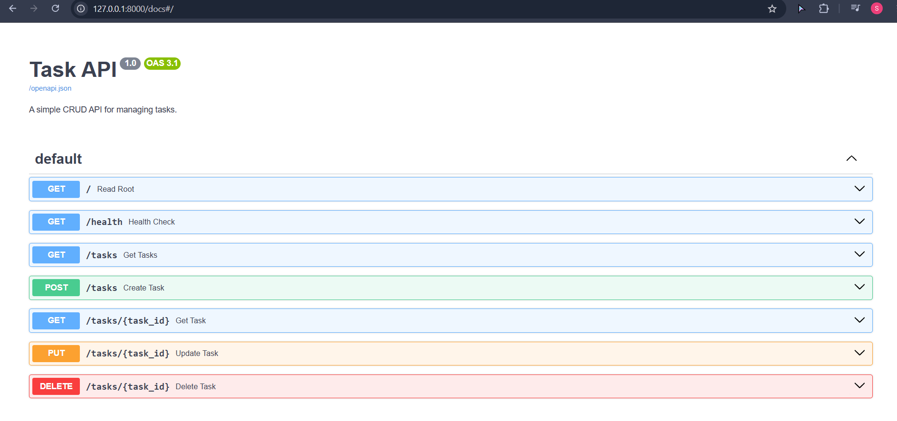

# Task API

A simple CRUD API for managing tasks, built with FastAPI as part of the FlyRank AI Internship.

## Current setup (Assignment 3 — Postgres + Docker)

This project now runs against a real **PostgreSQL** database, fully containerized with Docker. Both the app and database start together with a single command.

### Run it

```bash
git clone https://github.com/Swathy-S-08/CRUD_API-.git
cd CRUD_API-/hello-server
cp .env.example .env
docker compose up
```

Then visit `http://localhost:8000`.

### Environment variables

Copy `.env.example` to `.env` and adjust if needed. It sets:

| Variable | Description |
|---|---|
| `DATABASE_URL` | Postgres connection string, e.g. `postgres://postgres:dev@db:5432/tasks` |

### Endpoints

| Method | Endpoint | Description | Success | Error |
|--------|----------|--------------|---------|--------|
| GET | `/` | API info | 200 | — |
| GET | `/health` | Health check | 200 | — |
| GET | `/tasks` | List all tasks | 200 | — |
| GET | `/tasks/{id}` | Get a single task | 200 | 404 if not found |
| POST | `/tasks` | Create a task (`{"title": "..."}`) | 201 | 400 if title missing/empty |
| PUT | `/tasks/{id}` | Update a task's title and/or done | 200 | 404 if not found, 400 if title invalid |
| DELETE | `/tasks/{id}` | Delete a task | 204 | 404 if not found |

### Example request

```
curl -i http://localhost:8000/tasks
```

```
HTTP/1.1 200 OK
date: Mon, 11 Aug 2026 16:29:10 GMT
server: uvicorn
content-length: 142
content-type: application/json

[{"id":1,"title":"Learn FastAPI","done":false},{"id":2,"title":"Build a CRUD API","done":false},{"id":3,"title":"Push to GitHub","done":true}]
```

### Data persistence

Task data lives in a Docker volume (`taskdata`), so it survives a full `docker compose down` + `docker compose up` — verified during development by creating tasks, tearing the stack down, bringing it back up, and confirming the same tasks were still present.

### Database screenshot



---

## AI vs me — Assignment 3 (Containerize the stack)

### My prompt

> I want my app to be connected to a real live database. So let's containerize the tasks into Postgres. All five endpoints with identical behaviour to my hand-built version. The password should be from `.env`, it should not be hardcoded. Use parameterized queries, never insert the user input directly. Use a Docker volume so that the database data persists even when it is removed. Give me the files with these changes.

### What the AI did better

- **Healthcheck on the `db` service.** The AI used a `pg_isready`-based healthcheck combined with `depends_on: condition: service_healthy`, so the `api` container actually waits until Postgres is ready to accept connections before starting. My version only uses a plain `depends_on`, which starts `db` first but doesn't wait for it to finish initializing — this is exactly the "is the server running on that host" race condition I hit the first time I ran `docker compose up`.
- **Pinned the Postgres image version** (`postgres:17`) instead of `latest`. My version uses `latest`, which pulled Postgres 18 and immediately broke on the old volume mount path (`/var/lib/postgresql/data`) — a real bug I had to debug and fix by switching to `/var/lib/postgresql`. Pinning the version avoids that entire class of surprise.
- **Fails fast if the password is missing.** The AI's code explicitly checks `if not DB_PASSWORD: raise RuntimeError(...)` at startup, so a missing `.env` value errors immediately and loudly instead of silently hanging (which is what happened to me when `DATABASE_URL` came back as `None` due to a typo).
- **Stricter input validation** — it rejects a `done` field that isn't a real boolean, which my version doesn't check at all.
- **`closing()` context manager** around every database connection, guaranteeing the connection is released even if an error occurs mid-request.

### What it got wrong or ignored

- **Missing `GET /` and `GET /health`.** Both are present in my hand-built version but absent from the AI's, since I didn't mention them in this prompt either — the same gap that showed up in my A1 and A2 rematches.
- **Uses the deprecated `@app.on_event("startup")` pattern** instead of FastAPI's current `lifespan` context manager.
- **Thinner README** — no endpoint table, no example `curl` output, and no explanation of what `.env.example` is for.
- **No `.env.example` committed alongside a real `.env`-based setup** — the assignment requires committing a placeholder `.env.example`; the AI's output didn't include one by default.
- **Code fragmented across multiple files between assignments.** Rather than evolving one `main.py` in place the way I did (SQLite → Postgres, all in the same file, tracked through commit history), the AI's generations across assignments produced separate files (`main.py`, `main_updated.py`, `main3.py`). Same underlying issue as the first attempt not reusing/updating a single source of truth.

### What my prompt forgot to specify

I didn't mention `GET /` or `GET /health` in this prompt (same recurring gap from my earlier prompts), so the AI reasonably didn't build them. I also didn't specify a Postgres image version, which is exactly why the AI made its own (better) choice to pin `postgres:17` — a good reminder that being unspecific sometimes lets the AI make a smarter call than I did on my own.

### The rematch

I updated my prompt to explicitly require: include `GET /` and `GET /health`, commit a `.env.example` file alongside real `.env` usage, use parameterized queries, use a Docker volume for persistence, pin the Postgres image to a specific version instead of `latest`, and write the whole app as a single `main.py` file rather than splitting it across multiple files.

**What changed:** every single requested fix showed up in the regenerated output. `GET /` and `GET /health` were both added (with `/health` going further than asked — it runs a real `SELECT 1` against the database and returns `503` if the database is unreachable). A `.env.example` was included this time. The Postgres image was pinned even more specifically than before (`postgres:17.6` vs. the first attempt's `postgres:17`). And the whole app came back as one `main.py` file instead of fragmenting into `main.py` / `main_updated.py` / `main3.py` across generations, directly fixing the drift I'd noticed compared to my own single evolving file. As a bonus I hadn't explicitly asked for, it also swapped the deprecated `@app.on_event("startup")` pattern (flagged as an issue in the first attempt) for FastAPI's modern `lifespan` context manager. This is a sharp contrast to my Assignment 1 rematch, where a more precise prompt produced byte-for-byte identical code — here, the AI clearly re-reasoned from the new prompt and incorporated every correction.

---

## AI vs me — Assignment 1

### My prompt (first attempt)

Build a REST API in Python using FastAPI with an in-memory list of tasks. Each task has an id, title, and a boolean done field, pre-filled with 3 example tasks. Include: GET /tasks to list all tasks, GET /tasks/{id} to get one task (404 with a JSON error if not found), POST /tasks to create a task from a JSON body (400 with a JSON error if title is missing or empty), PUT /tasks/{id} to update a task's title and/or done status (404 if not found), and DELETE /tasks/{id} to remove a task, returning 204 with no body. Enable Swagger UI docs.

### What the AI did better

The AI used Pydantic models (`Task`, `TaskCreate`, `TaskUpdate`) as real class-based schemas instead of raw dicts, and factored the repeated "find task or 404" logic into one `find_task()` helper instead of the loop I copy-pasted into three endpoints. I understand this well enough to explain it: Pydantic validates incoming JSON shape automatically before the function body runs, and centralizing `find_task()` means the 404 check only has to be written and maintained once.

### What it got wrong or ignored

- **404 error shape is nested, not flat.** `GET /tasks/99` returned:

HTTP/1.1 404 Not Found
{"detail":{"error":"task 99 not found"}}
  I asked for a flat `{"error": "..."}`. FastAPI's `HTTPException(detail=...)` always wraps whatever you pass inside a `"detail"` key, so `detail={"error": ...}` produces this extra nesting.

- **POST with missing title returns 422, not 400.** Posting `{}` to `/tasks` returned:
HTTP/1.1 422 Unprocessable Content
{"detail":[{"type":"missing","loc":["body","title"],"msg":"Field required",...}]}
  I asked for `400`. Because the AI made `title: str` required directly on the Pydantic model, FastAPI intercepts the request before the function body runs and auto-returns its own `422` — it never wrote a hand-checked `400` like I did.

- **DELETE returns 200 with a body, not 204 with an empty body.**
HTTP/1.1 200 OK
{"message":"task 1 deleted successfully"}
  I was explicit about `204 No Content` with an empty body.

- **Missing endpoints.** I forgot to mention `GET /` and `GET /health` in this prompt, so the AI didn't build them — a gap in my prompt, not the AI's fault.

- **Unrequested extra endpoint.** The AI added `PATCH /tasks/{id}`, duplicating the PUT logic exactly, which I never asked for.

- **Field name mismatch.** The AI used `completed` instead of `done`.

### What my prompt forgot to specify — and what the AI silently decided

I never specified the exact JSON shape for error bodies, so the AI defaulted to FastAPI's built-in `HTTPException`/`detail` convention. I didn't say "only build these five endpoints," so it added an unrequested `PATCH`. And I didn't pin down the exact field name, so it picked `completed` over `done` — a reasonable but silent decision that would break any client written against my original spec.

### The rematch

I rewrote my prompt to explicitly specify: the field name `done` (not `completed`), a flat error shape `{"error": "..."}` instead of FastAPI's default `detail` wrapper, that a missing/empty title must return a hand-checked `400` rather than Pydantic's automatic `422`, that DELETE must return `204` with an empty body, and that no endpoints beyond the five CRUD routes should be added.

**What changed:** nothing — the regenerated code was byte-for-byte identical to the first attempt, down to the same field name, same nested error shape, same extra `PATCH` endpoint, and same `200` on delete. My more precise prompt had no effect on the output, which was the most interesting result of this stage: it suggests the AI tool reused/anchored to its earlier answer rather than genuinely re-reasoning from the new prompt, and it's a reminder that "asked more precisely" doesn't automatically mean "got a different or better answer" — regeneration behavior matters as much as prompt wording.


## AI vs me — Assignment 2 (SQLite migration)

### My prompt (first attempt)

Migrate a FastAPI in-memory task API to use a SQLite database. Store tasks in a file called task.db, with a tasks table containing id, title, and a boolean done column. Create the table if it doesn't exist, and seed three example tasks only if the table is empty. Keep the same five CRUD endpoints (GET /tasks, GET /tasks/{id}, POST /tasks, PUT /tasks/{id}, DELETE /tasks/{id}) with identical behavior to before: 400 for a missing/empty title, 404 for an unknown id, 201 on create, 204 on delete. Use parameterized queries for all SQL.

### What the AI did better

It used a `closing()` context manager around every database connection, guaranteeing the connection closes even if an error occurs mid-request — more robust than my manual `conn.close()` calls, which could get skipped if an exception happened first. It also factored row-to-JSON conversion and 404 handling into small reusable helper functions (`row_to_task()`, `task_not_found()`) instead of repeating that logic in every endpoint like I did. Most notably, it added strict type validation on the `done` field — rejecting a request where `done` isn't actually a boolean (e.g. a string like `"yes"`) with a `400`. My hand-built version never checks this at all; it would silently accept and store garbage into that column.

### What it got wrong or quietly ignored

- **Database filename typo, carried through faithfully.** I mistyped `task.db` instead of `tasks.db` in my prompt, and the AI didn't catch or question it — it just built the whole app around the wrong filename, creating a completely separate database file from my hand-built version.
- **Missing `GET /` and `GET /health`.** I forgot to mention these in my first prompt, so the AI didn't include them — same gap as my A1 rematch.
- **Unrequested `PATCH /tasks/{id}` endpoint**, duplicating `PUT`'s logic exactly, which I never asked for — same pattern as the AI added in my A1 rematch too.

### What my prompt forgot to specify — and what the AI silently decided

I never specified the exact JSON error message text or capitalization, so the AI used its own lowercase phrasing (`"task 1 not found"`) rather than matching my hand-built version's wording. I also didn't explicitly restrict the AI to *only* the five CRUD routes plus root/health, so it added the extra `PATCH` route on its own initiative — a reasonable REST convention, but not something I asked for. And the `task.db` typo is really on me, not a silent AI decision — but it's a good demonstration of how literally an AI will follow a spec, typos and all, with no pushback.

### The rematch

I corrected my prompt to say: use the exact filename `tasks.db`, include `GET /` and `GET /health`, and build only the five CRUD routes plus those two — no PATCH or any other extra endpoint.

**What changed:** all three issues were fixed exactly as requested — the database file is now `tasks.db`, both `GET /` and `GET /health` are present, and the unrequested `PATCH` endpoint was removed. Everything else (the helper functions, the `closing()` pattern, the strict boolean validation) stayed the same between generations, since I didn't ask for those to change. This rematch went noticeably better than my A1 rematch, where the regenerated code was identical to the first attempt despite a more detailed prompt — here, the AI clearly incorporated every specific correction I made.


## Database

This project used **SQLite** for storage in Assignment 2 (a single file, `tasks.db`, requiring zero setup). Assignment 3 migrated storage to **PostgreSQL**, running in Docker — see the "Current setup" section at the top of this README for how to run it now.

## Interactive docs

FastAPI auto-generates Swagger UI at `/docs`:

